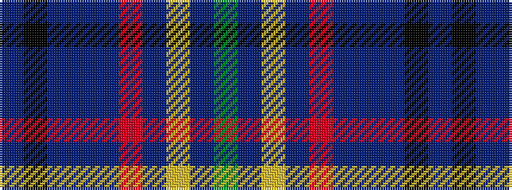

BKBBBRBYBG

It is a 10 stripe tartan.

<figure class="pat-woven">

<figcaption>idealised sample</figcaption>
</figure>

## Colour Sequence



## Tartans with this colour sequence

| Tartans |
|---------------|
| [Fed. of Circles & Solitaries (Corp.)](/setts/s10/db9k30db9t3db5r3db5ly3db5g3~x2/)|
||
