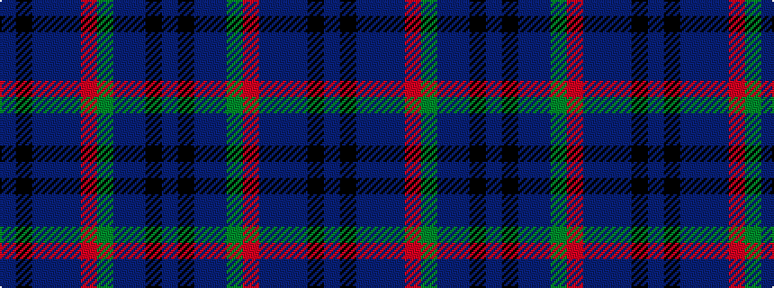

BKBBBRGBBKB

It is a 11 stripe tartan.

<figure class="pat-woven">

<figcaption>idealised sample</figcaption>
</figure>

## Colour Sequence



## Tartans with this colour sequence

| Tartans |
|---------------|
| [Unidentified No 20](/variants/s11/t3k2t2b8db20r4dg16b4t2k2t3/)|
||
| [Unnamed, No 20](/variants/s11/t3k2t2b8db20r4g16b4t2k2t3/)|
||
