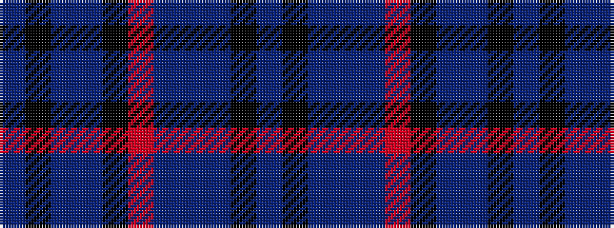

BKBBBRKBBKB

It is a 11 stripe tartan.

<figure class="pat-woven">

<figcaption>idealised sample</figcaption>
</figure>

## Colour Sequence



## Tartans with this colour sequence

| Tartans |
|---------------|
| [Norwich No.020](/variants/s11/t3k1t1db4t10r2ki8db2t1k1t3~x2/)|
||
