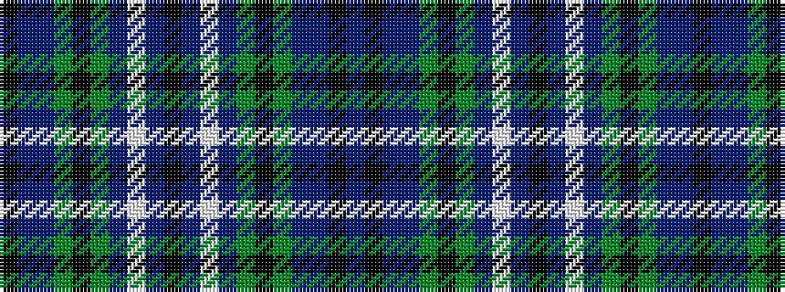

BKBBGKGBWBKBWBGKGBBK

It is a 20 stripe tartan.

<figure class="pat-woven">

<figcaption>idealised sample</figcaption>
</figure>

## Colour Sequence



## Tartans with this colour sequence

| Tartans |
|---------------|
| [Wacker](/variants/s20/db6k3db3dt13g13k1g13dt13w1db3k3~x2/)|
||
