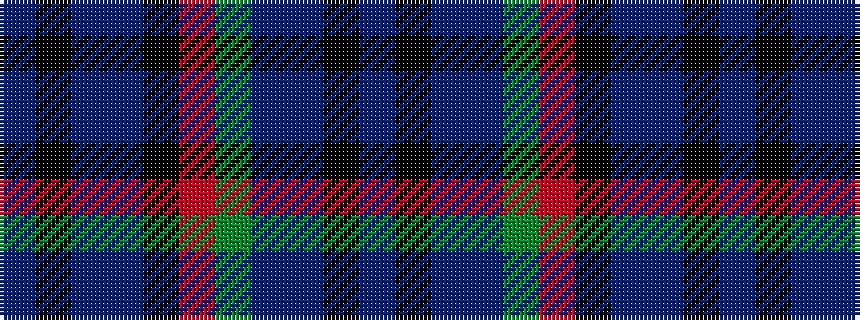

BKBBGRKBBKB

It is a 11 stripe tartan.

<figure class="pat-woven">

<figcaption>idealised sample</figcaption>
</figure>

## Colour Sequence



## Tartans with this colour sequence

| Tartans |
|---------------|
| [Unidentified No 22](/variants/s11/t2k1t1db2k8r2dg8db2t1k1t2~x2/)|
||
| [Unnamed, No 22](/variants/s11/t2k1t1db2k8r2g8db2t1k1t2~x2/)|
||
