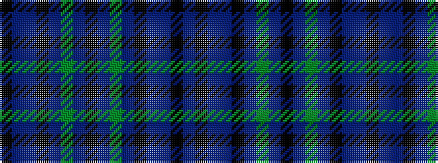

BKBBKBGBKBGBKBBK

It is a 16 stripe tartan.

<figure class="pat-woven">

<figcaption>idealised sample</figcaption>
</figure>

## Colour Sequence



## Tartans with this colour sequence

| Tartans |
|---------------|
| [Hebrides #10](/variants/s16/k2db18t1k13t1g16db3k2db3g16t1k13t1db18k2db2~x2/)|
||
