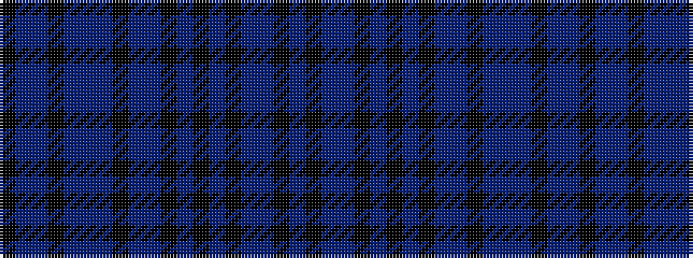

BKBBKBKBKBBKBBBKBBK

It is a 19 stripe tartan.

<figure class="pat-woven">

<figcaption>idealised sample</figcaption>
</figure>

## Colour Sequence



## Tartans with this colour sequence

| Tartans |
|---------------|
| [Longniddry (Fashion?)](/setts/s19/k16db4db2ki2db4db6db4ki2db2db16k3db3ki3db3k3db16db2ki2db3~x2/)|
||
