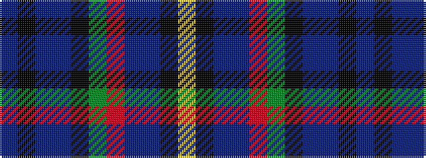

BKBBKGRBBKY

It is a 11 stripe tartan.

<figure class="pat-woven">

<figcaption>idealised sample</figcaption>
</figure>

## Colour Sequence



## Tartans with this colour sequence

| Tartans |
|---------------|
| [Amarillo District Tartan Tartan Number: 2190. Earliest known date: 1996 Designed for the city of Amarillo in Texas, USA, by Dr. Phil Smith, at West Chester University in Penn. The tartan has been adopted by the city authorities. See products available Copyright © Blair Urquhart, Comrie, 2015](/setts/s11/db18k2t2db9k4g9r4db9t2k2ly1~x4/)|
||
