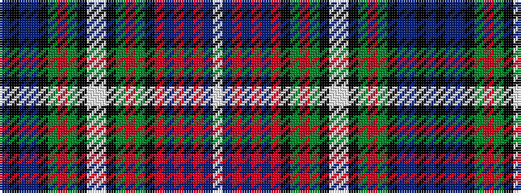

BKBBKGRGKWWKGRGKRBRBRBW

It is a 23 stripe tartan.

<figure class="pat-woven">

<figcaption>idealised sample</figcaption>
</figure>

## Colour Sequence



## Tartans with this colour sequence

| Tartans |
|---------------|
| [Rankin (Dalgleish)](/setts/s23/db18k2db2db2k20g10r2g10k1lb1lb2k1g10r2g10k20r1db14r3db2r2db4lb1~x2/)|
||
