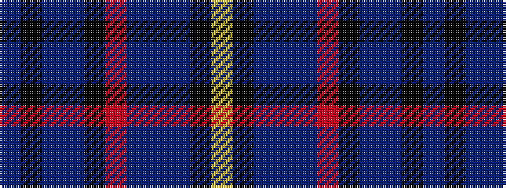

BKBBKRBBBKY

It is a 11 stripe tartan.

<figure class="pat-woven">

<figcaption>idealised sample</figcaption>
</figure>

## Colour Sequence



## Tartans with this colour sequence

| Tartans |
|---------------|
| [Cian (Carroll), Clan](/setts/s11/db16k1t1db10k4o8dp4db7t1k1lo2~x2/)|
||
