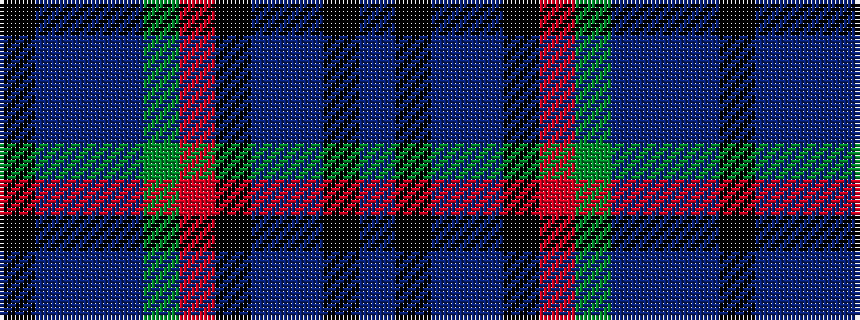

BKBBKRGBBBK

It is a 11 stripe tartan.

<figure class="pat-woven">

<figcaption>idealised sample</figcaption>
</figure>

## Colour Sequence



## Tartans with this colour sequence

| Tartans |
|---------------|
| [Wilson's No.060](/setts/s11/k16db2t2db4g16r2k15db6t2k3t4~x2/)|
||
