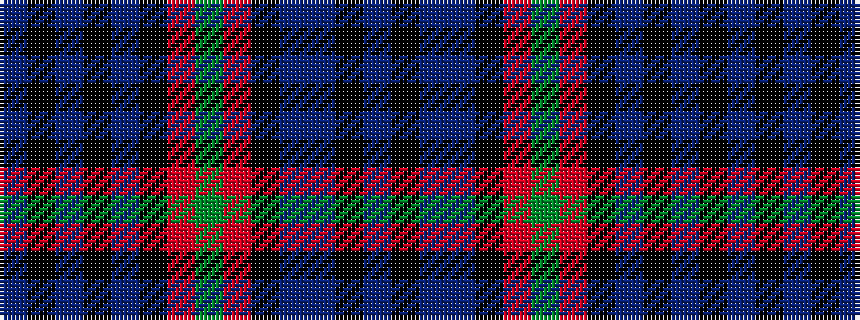

BKBBKRGRKBKBKB

It is a 14 stripe tartan.

<figure class="pat-woven">

<figcaption>idealised sample</figcaption>
</figure>

## Colour Sequence



## Tartans with this colour sequence

| Tartans |
|---------------|
| [Riddoch](/setts/s14/db8k1db1k1db1k8r1dg14r1k8db8db1k1db1~x4/)|
||
