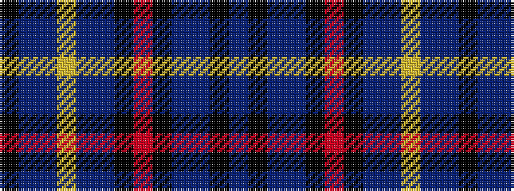

BKBBKRKBBYBBK

It is a 13 stripe tartan.

<figure class="pat-woven">

<figcaption>idealised sample</figcaption>
</figure>

## Colour Sequence



## Tartans with this colour sequence

| Tartans |
|---------------|
| [Blue Brough from Orkney](/setts/s13/k4n8db54ly6db23n4k4r14k4n2db2k4db4/)|
||
