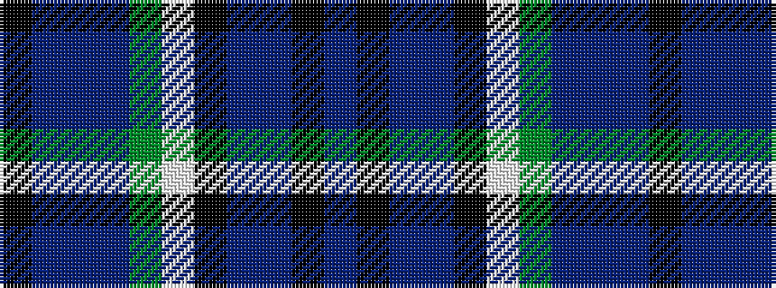

BKBBKWGBBBK

It is a 11 stripe tartan.

<figure class="pat-woven">

<figcaption>idealised sample</figcaption>
</figure>

## Colour Sequence



## Tartans with this colour sequence

| Tartans |
|---------------|
| [U.S.I. Limited](/variants/s11/k20n2t2n4dg20w2k16n7t2k3t5~x2/)|
||
