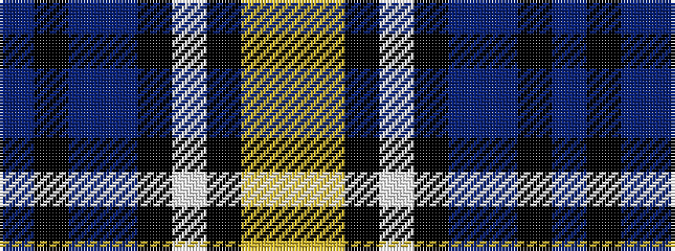

BKBBKWKYY

It is a 9 stripe tartan.

<figure class="pat-woven">

<figcaption>idealised sample</figcaption>
</figure>

## Colour Sequence



## Tartans with this colour sequence

| Tartans |
|---------------|
| [Carbon](/variants/s9/do68k4do18dt20k3lb3k10lr8lo4/)|
||
