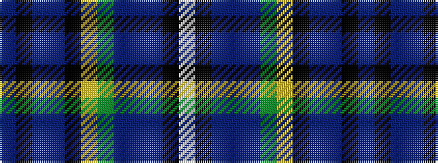

BKBBKYGBBBKW

It is a 12 stripe tartan.

<figure class="pat-woven">

<figcaption>idealised sample</figcaption>
</figure>

## Colour Sequence



## Tartans with this colour sequence

| Tartans |
|---------------|
| [Veere](/variants/s12/t4k3t2db6k15ly2g16db4t2db2k8w4~x2/)|
||
