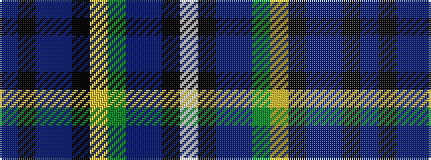

BKBBKYGBBKW

It is a 11 stripe tartan.

<figure class="pat-woven">

<figcaption>idealised sample</figcaption>
</figure>

## Colour Sequence



## Tartans with this colour sequence

| Tartans |
|---------------|
| [Veere (District)](/variants/s11/db6k2n2db8k18lo2g20db8n3k10lb6~x2/)|
||
