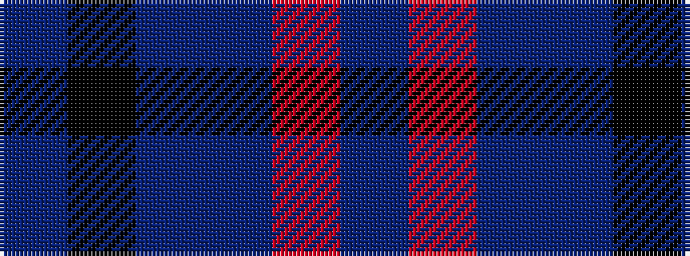

BKBBRB

It is a 6 stripe tartan.

<figure class="pat-woven">

<figcaption>idealised sample</figcaption>
</figure>

## Colour Sequence



## Tartans with this colour sequence

| Tartans |
|---------------|
| [MacTavish](/tartans/b2r12db2b6k6b1/)|
||
| [MacTavish #2](/setts/s6/t1r6db1t3k3t1~x8/)|
||
| [Thompson/Thomson/MacTavish](/tartans/t2r12db2t6k6t1/)|
||
