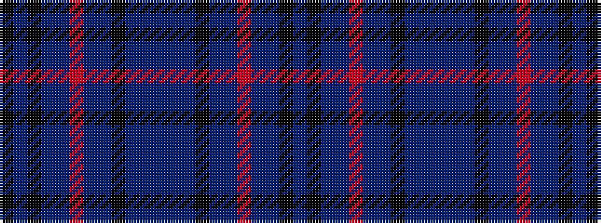

BKBBRBBKBBBBBKBBRBBKBK

It is a 22 stripe tartan.

<figure class="pat-woven">

<figcaption>idealised sample</figcaption>
</figure>

## Colour Sequence



## Tartans with this colour sequence

| Tartans |
|---------------|
| [Greyhound Grenadiers Pipe Band](/variants/s22/k2n2k2n1n10r2n4n10k4b9n10n2~x2/)|
||
