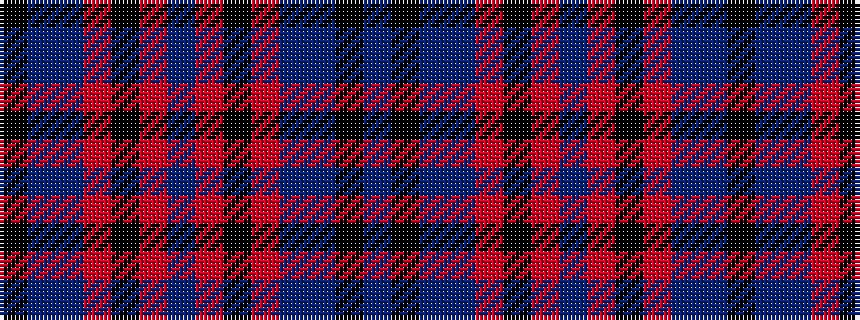

BKBBRKRBRKRBBK

It is a 14 stripe tartan.

<figure class="pat-woven">

<figcaption>idealised sample</figcaption>
</figure>

## Colour Sequence



## Tartans with this colour sequence

| Tartans |
|---------------|
| [Longniddry Dress Lavender Fancy Tartan Tartan Number: 6468. Earliest known date: pre 1992 Dancers tartan from D.C. Dalgleish swatch book. In stock in 2004. See products available Copyright © Blair Urquhart, Comrie, 2015](/setts/s14/k32p12db5o2k2o2db42o2k2o2db5p12k32db4~x2/)|
||
