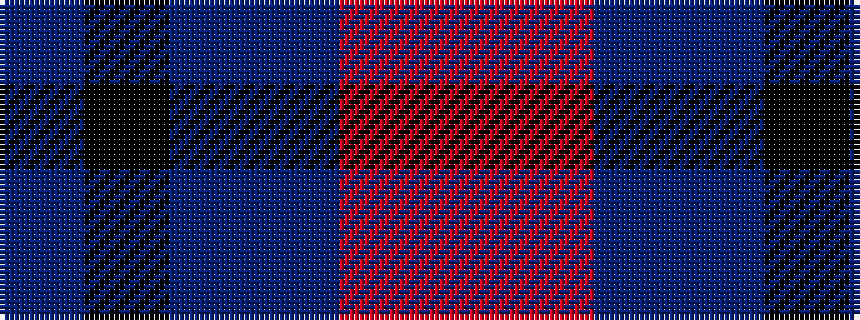

BKBBRR

It is a 6 stripe tartan.

<figure class="pat-woven">

<figcaption>idealised sample</figcaption>
</figure>

## Colour Sequence



## Tartans with this colour sequence

| Tartans |
|---------------|
| [Thom(p)son's, Fancy](/setts/s6/r2o8db2t4k4t1~x6/)|
||
