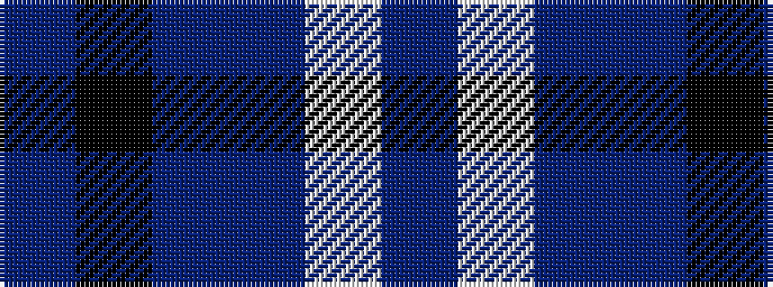

BKBBWB

It is a 6 stripe tartan.

<figure class="pat-woven">

<figcaption>idealised sample</figcaption>
</figure>

## Colour Sequence



## Tartans with this colour sequence

| Tartans |
|---------------|
| [Thompson (Dance)](/setts/s6/b1lb6db1b3k3b1~x8/)|
||
