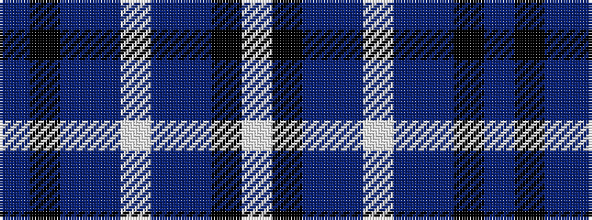

BKBBWBBKW

It is a 9 stripe tartan.

<figure class="pat-woven">

<figcaption>idealised sample</figcaption>
</figure>

## Colour Sequence



## Tartans with this colour sequence

| Tartans |
|---------------|
| [Hebridean Arisaid Blue (Dance) Fashion Tartan](/variants/s9/w17k2n6t6w1n1dp10k2dp3~x4/)|
||
