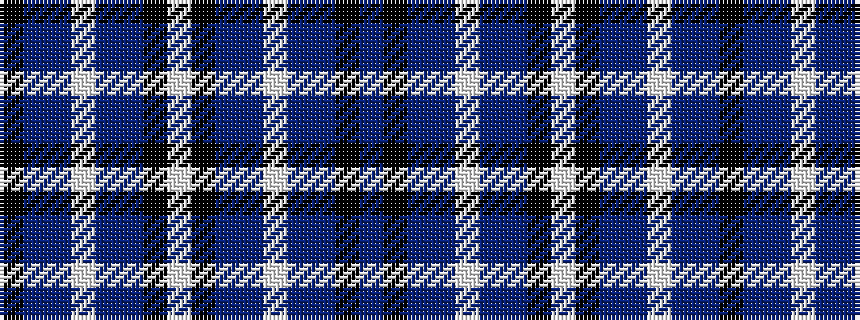

BKBBWBBKWKBBWBBK

It is a 16 stripe tartan.

<figure class="pat-woven">

<figcaption>idealised sample</figcaption>
</figure>

## Colour Sequence



## Tartans with this colour sequence

| Tartans |
|---------------|
| [Hebridean Arisaid Blue (Dance)](/variants/s16/w37k4db12b12w2t2dp23k4dp6~x2/)|
||
