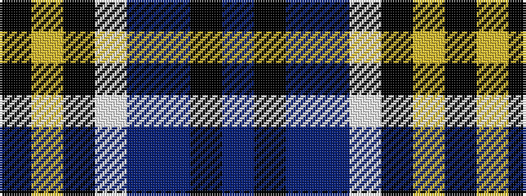

BKBBWKYK

It is a 8 stripe tartan.

<figure class="pat-woven">

<figcaption>idealised sample</figcaption>
</figure>

## Colour Sequence



## Tartans with this colour sequence

| Tartans |
|---------------|
| [Washington County Sheriff’s Office (Oregon)](/setts/s8/t6k6t6db3w1k39ly3k3~x2/)|
||
