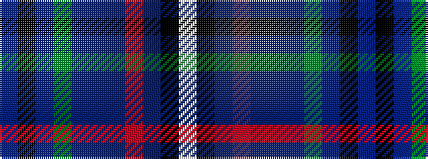

BKBGBBBRBKW

It is a 11 stripe tartan.

<figure class="pat-woven">

<figcaption>idealised sample</figcaption>
</figure>

## Colour Sequence



## Tartans with this colour sequence

| Tartans |
|---------------|
| [Blue Pride](/setts/s11/b38k4b2g6p11db3p2m2b11k1w2~x2/)|
||
| [Blue Pride](/setts/s11/b38k4b2g6p11db3p2r2b11k1w2~x2/)|
||
| [Highland Pride 2 (Fashion)](/setts/s11/db38k4db2dg6dp11dt3dp2r2db11k1w2~x2/)|
||
