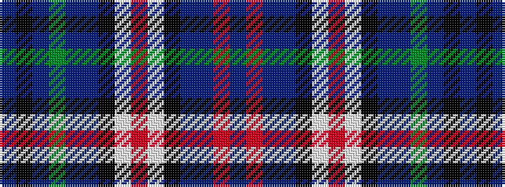

BKBGBBKWRWKBBRB

It is a 15 stripe tartan.

<figure class="pat-woven">

<figcaption>idealised sample</figcaption>
</figure>

## Colour Sequence



## Tartans with this colour sequence

| Tartans |
|---------------|
| [Spirit of de Jong](/variants/s15/dt103r12dt20db7k5w5ri5w5k5db7dt5dg32dp14k5dp22/)|
||
