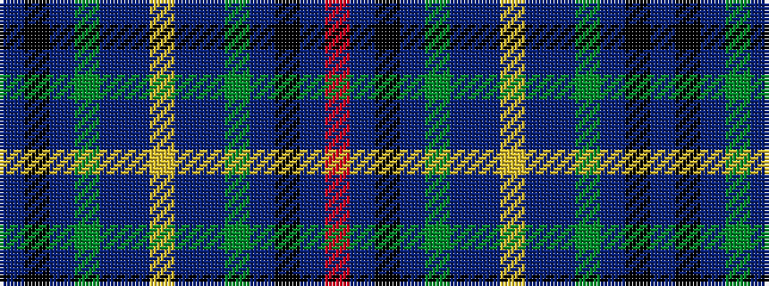

BKBGBBYBBGBKBR

It is a 14 stripe tartan.

<figure class="pat-woven">

<figcaption>idealised sample</figcaption>
</figure>

## Colour Sequence



## Tartans with this colour sequence

| Tartans |
|---------------|
| [Los Angeles District Tartan Tartan Number: 6071. Earliest known date: 01/01/2003 Based on the Los Angeles coat of arms. Slightly different thread count for the blues in the weft. See products available Copyright © Blair Urquhart, Comrie, 2015](/setts/s14/t33k5b3g2t5b24ly4b24t5g2b3k5t33r2~x2/)|
||
