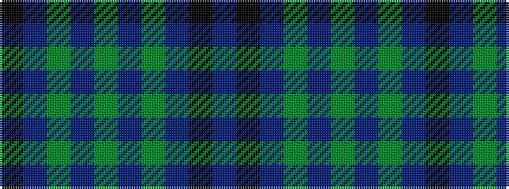

BKBGBGBGBK

It is a 10 stripe tartan.

<figure class="pat-woven">

<figcaption>idealised sample</figcaption>
</figure>

## Colour Sequence



## Tartans with this colour sequence

| Tartans |
|---------------|
| [Falconer of Labhdal Personal Tartan](/variants/s10/k7t7g20t2g2t2g20t7k7t7~x4/)|
||
