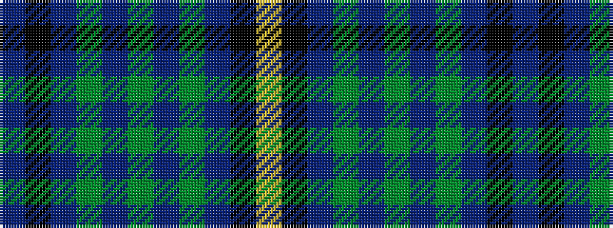

BKBGBGBGBKY

It is a 11 stripe tartan.

<figure class="pat-woven">

<figcaption>idealised sample</figcaption>
</figure>

## Colour Sequence



## Tartans with this colour sequence

| Tartans |
|---------------|
| [Muir Homes](/variants/s11/db66k20dbi7y4dbi5y4dbi5y4dbi7k2lr6/)|
||
