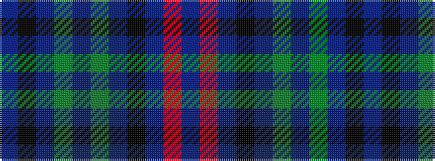

BKBGBGBKBRB

It is a 11 stripe tartan.

<figure class="pat-woven">

<figcaption>idealised sample</figcaption>
</figure>

## Colour Sequence



## Tartans with this colour sequence

| Tartans |
|---------------|
| [Dunbarton Weft](/variants/s11/b30r2b2k5b3dy2b3dy22b3k2b3~x2/)|
||
