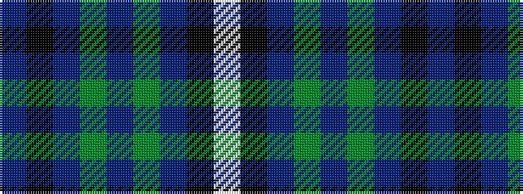

BKBGBGBKW

It is a 9 stripe tartan.

<figure class="pat-woven">

<figcaption>idealised sample</figcaption>
</figure>

## Colour Sequence



## Tartans with this colour sequence

| Tartans |
|---------------|
| [Basel Tattoo (Official)](/setts/s9/db1k8db2dg16dr6dg16db2k8w1~x2/)|
||
