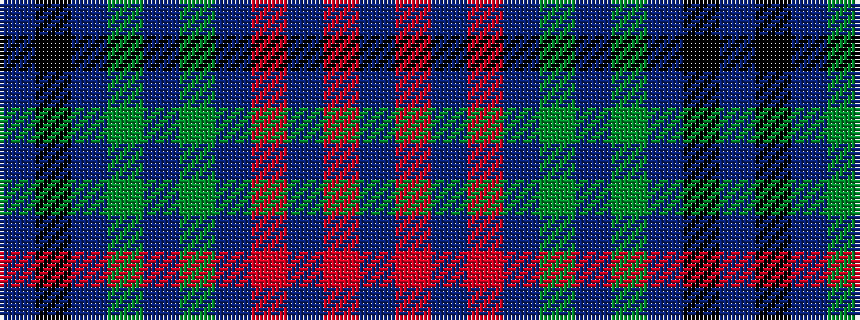

BKBGBGBRBRB

It is a 11 stripe tartan.

<figure class="pat-woven">

<figcaption>idealised sample</figcaption>
</figure>

## Colour Sequence



## Tartans with this colour sequence

| Tartans |
|---------------|
| [McCall/MacCall](/variants/s11/dr8k5dr8dg27dr13dg3dr13o27dr8o3dr3~x2/)|
||
