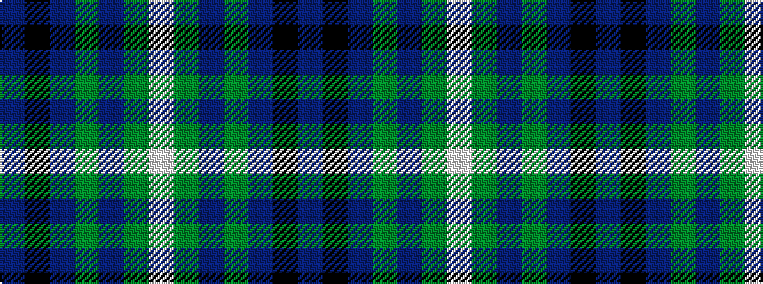

BKBGBGW

It is a 7 stripe tartan.

<figure class="pat-woven">

<figcaption>idealised sample</figcaption>
</figure>

## Colour Sequence



## Tartans with this colour sequence

| Tartans |
|---------------|
| [MTV](/variants/s7/dr5k3dr9dg56t4dg2w3/)|
||
| [Unidentified #44](/variants/s7/db13k3db20dy70db20dy30w3~x2/)|
||
