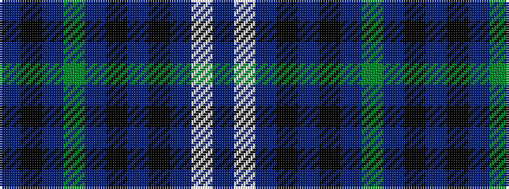

BKBGBKBKBWB

It is a 11 stripe tartan.

<figure class="pat-woven">

<figcaption>idealised sample</figcaption>
</figure>

## Colour Sequence



## Tartans with this colour sequence

| Tartans |
|---------------|
| [Bute Heather](/setts/s11/db13w2dt38k13dt8k8dp17dg2dp17k4db11/)|
||
| [Bute Heather, Ancient (Fashion)](/setts/s11/dp13w2t38k13t28k8dp17dg2dp17k4dt11/)|
||
| [Bute Heather, Modern](/setts/s11/db6w1db18k6db4k4dp8dg1dp8k2db5~x2/)|
||
