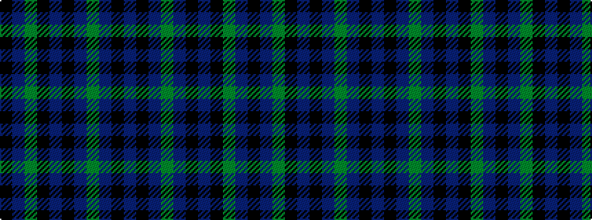

BKBGBKBKGBK

It is a 11 stripe tartan.

<figure class="pat-woven">

<figcaption>idealised sample</figcaption>
</figure>

## Colour Sequence



## Tartans with this colour sequence

| Tartans |
|---------------|
| [Priest](/tartans/k1b1y7k8b1k8b1y2b1k4b1/)|
||
