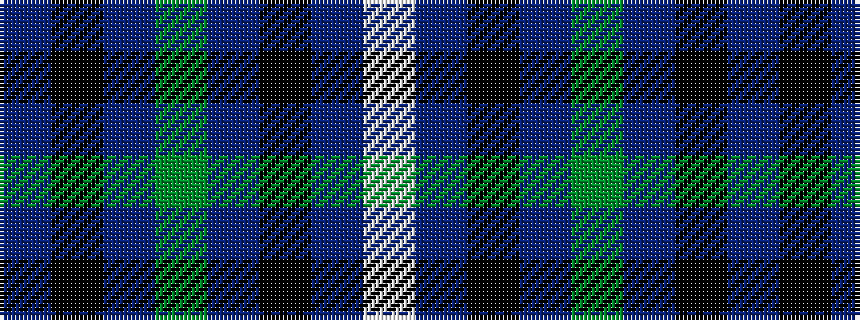

BKBGBKBW

It is a 8 stripe tartan.

<figure class="pat-woven">

<figcaption>idealised sample</figcaption>
</figure>

## Colour Sequence



## Tartans with this colour sequence

| Tartans |
|---------------|
| [Irvine of Drum](/variants/s8/t3k3t21g49t21k3t3w3~x2/)|
||
