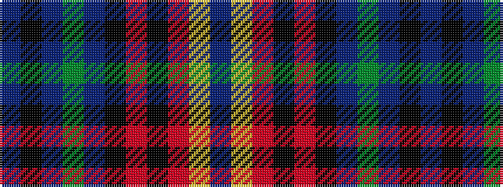

BKBGBKRKRYB

It is a 11 stripe tartan.

<figure class="pat-woven">

<figcaption>idealised sample</figcaption>
</figure>

## Colour Sequence



## Tartans with this colour sequence

| Tartans |
|---------------|
| [Bute Heather, Autumn](/setts/s11/db6ly1m18k6m4k4dp8dg1dp8k1db5~x2/)|
||
| [Bute Heather, Autumn (Fashion)](/setts/s11/dp13ly2r38k13r8k8dp17dg2dp17k4dp11/)|
||
