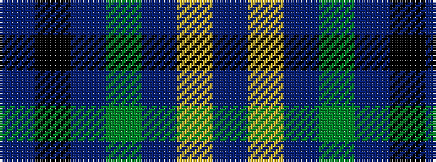

BKBGBYB

It is a 7 stripe tartan.

<figure class="pat-woven">

<figcaption>idealised sample</figcaption>
</figure>

## Colour Sequence



## Tartans with this colour sequence

| Tartans |
|---------------|
| [Cullen (Christian Hill)](/variants/s7/db8lo2db8dg7db57k3t1~x2/)|
||
| [Lowry](/variants/s7/dp6ly2dp1g25db16k2db4~x2/)|
||
