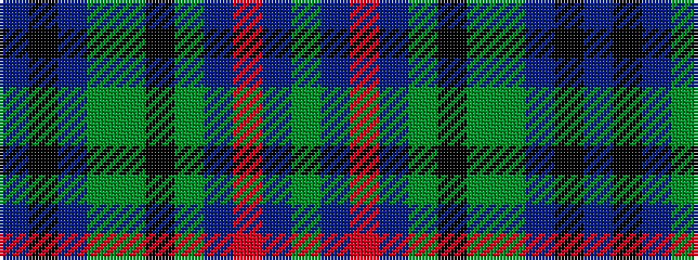

BKBGGKGBRBG

It is a 11 stripe tartan.

<figure class="pat-woven">

<figcaption>idealised sample</figcaption>
</figure>

## Colour Sequence



## Tartans with this colour sequence

| Tartans |
|---------------|
| [Donohoe Grey, Peter](/variants/s11/dy9db2r1db2dy3k9g3dy1n35k3n2~x2/)|
||
