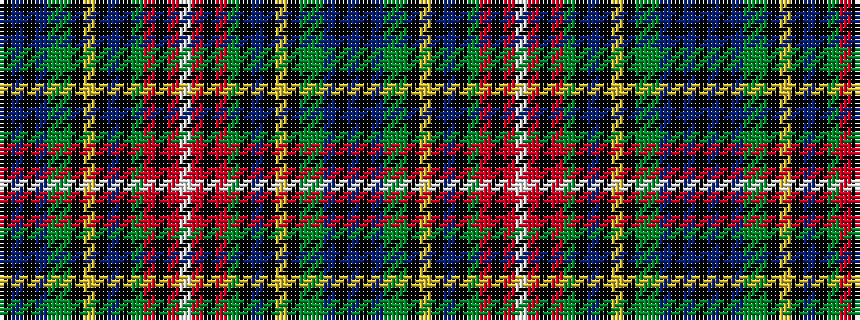

BKBGGKYKBKGRKRWRKRGKBKYKGGBKBK

It is a 30 stripe tartan.

<figure class="pat-woven">

<figcaption>idealised sample</figcaption>
</figure>

## Colour Sequence



## Tartans with this colour sequence

| Tartans |
|---------------|
| [Stewart](/setts/s30/db14k12db3dg22dg4k6ly2k2db2k2dg8r4k2r4lb2r4k2r4dg8k2db2k2ly2k6dg4dg22db3k12db14k4~x2/)|
||
