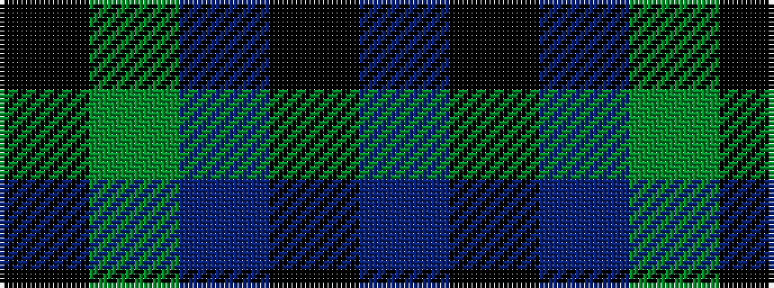

BKBGK

It is a 5 stripe tartan.

<figure class="pat-woven">

<figcaption>idealised sample</figcaption>
</figure>

## Colour Sequence



## Tartans with this colour sequence

| Tartans |
|---------------|
| [Austin](/setts/s5/db4k4db4dg9k2/)|
||
| [Austin](/setts/s5/db4k4db4dg9k2~x2/)|
||
| [Austin Clan](/setts/s5/db4k4db4g9k2~x2/)|
||
| [Austin WI](/setts/s5/n3k3n3dg6k2~x2/)|
||
| [Austin WI](/setts/s5/n3k3n3dg6k2/)|
||
| [Dallard (Personal)](/setts/s5/k37dg37n8k3dp5~x2/)|
||
| [Falconer](/setts/s5/b3k4b4g9k2~x4/)|
||
