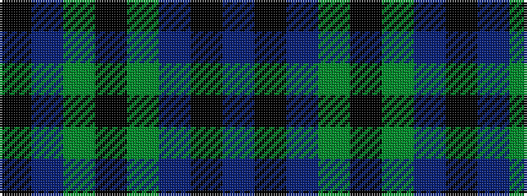

BKBGKGBK

It is a 8 stripe tartan.

<figure class="pat-woven">

<figcaption>idealised sample</figcaption>
</figure>

## Colour Sequence



## Tartans with this colour sequence

| Tartans |
|---------------|
| [Unidentified No 115](/setts/s8/db10k6t1dg6k1~x2/)|
||
| [Unnamed, No 115](/setts/s8/db10k6t1g6k1~x2/)|
||
