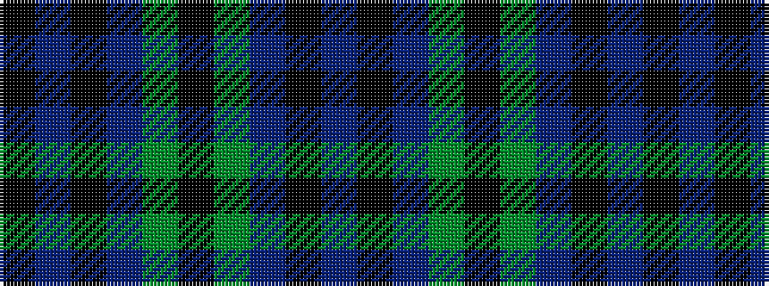

BKBGKGBKBK

It is a 10 stripe tartan.

<figure class="pat-woven">

<figcaption>idealised sample</figcaption>
</figure>

## Colour Sequence



## Tartans with this colour sequence

| Tartans |
|---------------|
| [Scott, Sir Walter](/variants/s10/dp9k11t2g9k3g9t2k11dp9k3~x2/)|
||
