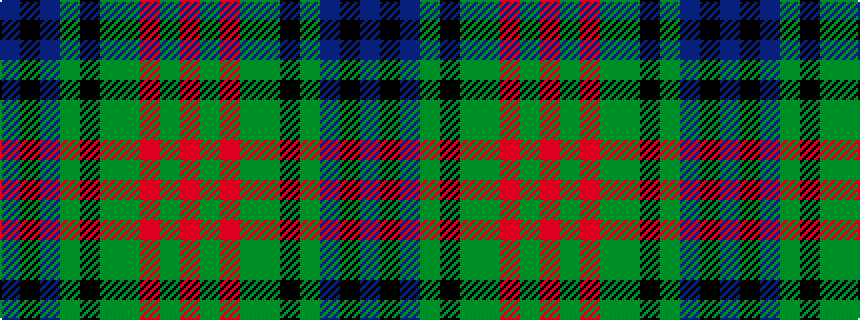

BKBGKGGRGR

It is a 10 stripe tartan.

<figure class="pat-woven">

<figcaption>idealised sample</figcaption>
</figure>

## Colour Sequence



## Tartans with this colour sequence

| Tartans |
|---------------|
| [Longford, County](/variants/s10/db5k3db18dg6k6dg6dy12r5dy12r3~x2/)|
||
