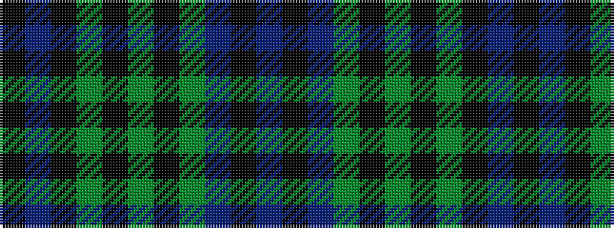

BKBGKGKGKBK

It is a 11 stripe tartan.

<figure class="pat-woven">

<figcaption>idealised sample</figcaption>
</figure>

## Colour Sequence



## Tartans with this colour sequence

| Tartans |
|---------------|
| [Paxton (Personal)](/variants/s11/k24dp5k9g3k2g3k2g14dp7k2dp10~x2/)|
||
| [Paxton (Personal)](/variants/s11/k48dp5k9g3k2g3k2g14dp7k2dp10~x2/)|
||
