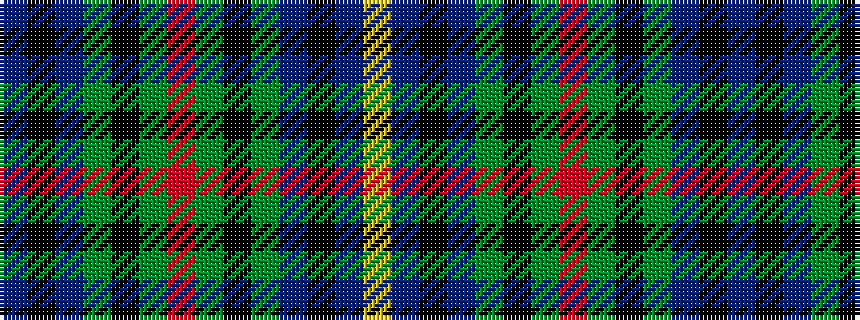

BKBGKGRGKGBKBY

It is a 14 stripe tartan.

<figure class="pat-woven">

<figcaption>idealised sample</figcaption>
</figure>

## Colour Sequence



## Tartans with this colour sequence

| Tartans |
|---------------|
| [Peter of Lee (Chief) (Personal)](/setts/s14/db3k3db21dg29k2dg4r4dg4k2dg29db21k3db3ly3~x2/)|
||
