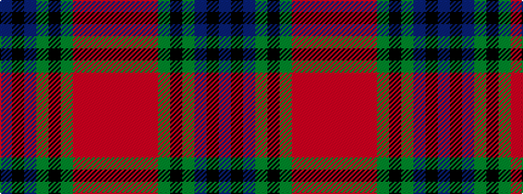

BKBGKGRRRR

It is a 10 stripe tartan.

<figure class="pat-woven">

<figcaption>idealised sample</figcaption>
</figure>

## Colour Sequence



## Tartans with this colour sequence

| Tartans |
|---------------|
| [Longford](/variants/s10/db8k3db18g6k8g6o12r5o12r3~x2/)|
||
