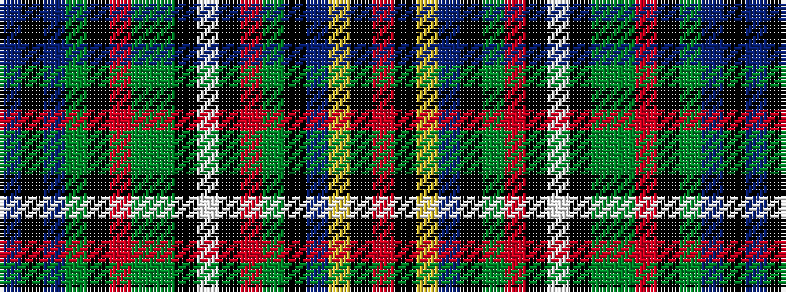

BKBGKRGGKWKRGKBYKR

It is a 18 stripe tartan.

<figure class="pat-woven">

<figcaption>idealised sample</figcaption>
</figure>

## Colour Sequence



## Tartans with this colour sequence

| Tartans |
|---------------|
| [Kukri](/variants/s18/db8k2db3dg3k3r3dg10g3k3w3k3m16dg6k3db8ly13k2m2~x2/)|
||
