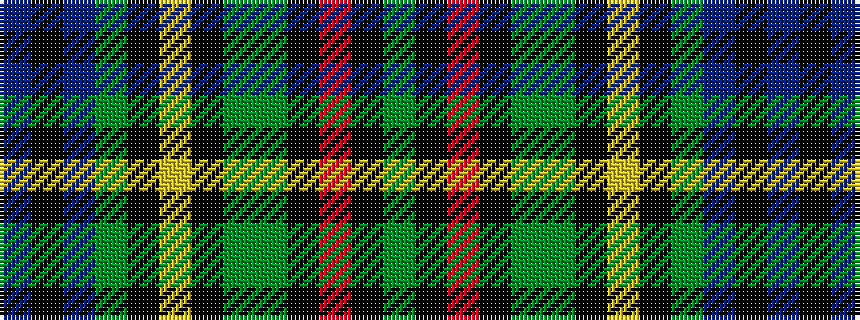

BKBGKYKGGKRKG

It is a 13 stripe tartan.

<figure class="pat-woven">

<figcaption>idealised sample</figcaption>
</figure>

## Colour Sequence



## Tartans with this colour sequence

| Tartans |
|---------------|
| [Greg Wells (Personal)](/setts/s13/dg12k1r2k1dg12y2k12ly1k12y2dt12k3dt12~x2/)|
||
